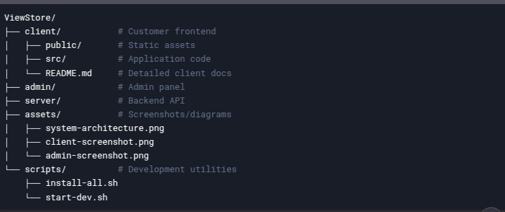

<!-- Schema.org markup for Google -->
<script type="application/ld+json">
{
  "@context": "https://schema.org",
  "@type": "SoftwareSourceCode",
  "name": "ViewStore E-Commerce Platform",
  "description": "Full-stack e-commerce solution with Next.js, Node.js and DevOps integration",
  "keywords": "ecommerce, nextjs, nodejs, docker, devops",
  "author": {
    "@type": "Person",
    "name": "Ahmed"
  },
  "codeRepository": "https://github.com/ahmed-838/ViewStore",
  "runtimePlatform": "Node.js",
  "softwareHelp": "https://github.com/ahmed-838/ViewStore/issues"
}
</script>

# 🛍️ ViewStore - Professional E-Commerce Platform

<div align="center">
  
  
  <!-- Badges Section -->
  [](https://github.com/ahmed-838/ViewStore/stargazers)
  [](./LICENSE)
  [](https://nodejs.org/)
  [](./CONTRIBUTING.md)
</div>

## 🌟 Key Features
- **Multi-interface System**: Seamless separation between customer store and admin panel
- **Production-Ready**: Dockerized with CI/CD pipelines
- **Real-time Sync**: Instant product updates across platforms
- **Modern Stack**: Built with cutting-edge technologies

## 🛠️ Tech Stack

### Frontend


### Backend


### DevOps


## 🏗️ Project Structure
| Directory | Tech Stack | Port | Description |
|-----------|------------|------|-------------|
| [`/client`](./client) | Next.js 14, TailwindCSS | 3001 | Customer storefront with cart functionality |
| [`/admin`](./admin) | Next.js 14, ShadCN UI | 3333 | Admin dashboard with real-time controls |
| [`/server`](./server) | Node.js, Express, MongoDB | 4444 | REST API with JWT authentication |

## 🔗 Project Links & Resources

<div align="center">
  <a href="https://viewstore.shop">
    
  </a>
  <a href="https://api.viewstore.example.com/docs">
    
  </a>
  <a href="./CONTRIBUTING.md">
    
  </a>
</div>

### 🌐 Essential Links
| Resource | Link | Description |
|----------|------|-------------|
| 🚀 Production Deployment | [https://viewstore.shop](https://viewstore.shop) | Main storefront |
| 🔧 Admin Dashboard | [https://admin.viewstore.shop](https://admin.viewstore.shop) | Admin control panel |
| 📚 API Docs | [https://api.viewstore.example.com/docs](https://api.viewstore.example.com/docs) | Interactive API documentation |


### 🔧 Development Resources
| Tool | Link | 
|------|------|
| 🐞 Issue Tracker | [GitHub Issues](https://github.com/ahmed-838/ViewStore/issues) |
| 📦 Package Registry | [ViewStore npm](https://npmjs.com/org/viewstore) |
| 🛠️ CI/CD Pipeline | [GitHub Actions](https://github.com/ahmed-838/ViewStore/actions) |
| 📊 Monitoring | [Grafana Dashboard](#) |


## 🚀 Professional Quick Start

### Prerequisites
- Node.js v18.19.1+ (`node -v`)
- npm v9.2.0+ (`npm -v`)
- MongoDB server running locally or remotely
- Git for version control

### Installation
```bash
# Clone repository
git clone https://github.com/ahmed-838/ViewStore.git
cd ViewStore

# Install dependencies for all services
./scripts/install-all.sh

# Configure environment
cp client/.env.example client/.env
cp admin/.env.example admin/.env
cp server/.env.example server/.env