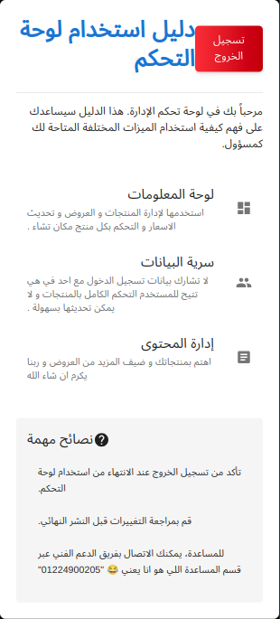
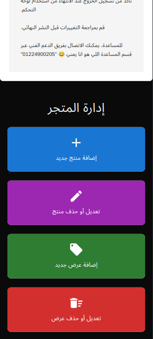
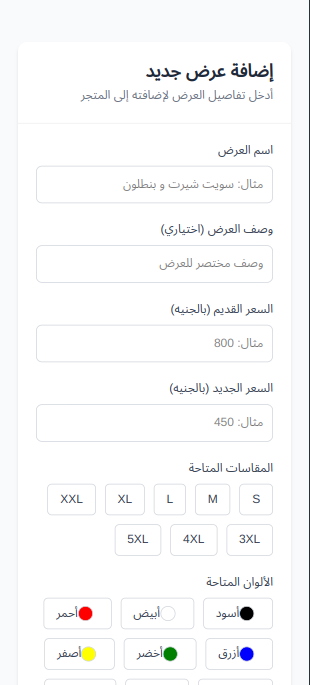

# 🖥️ ViewStore Admin Dashboard - Modern React Interface

## 🔗 Live Demo  

  
  
  

  
  
  
  
  
  
  
  

## 🌟 Key Features

<table>
  <tr>
    <td width="50%">
    
**🚀 Blazing Fast Performance**
- Static Site Generation (SSG)
- Client-side Rendering (CSR)
- Lazy loading components
- JavaScript optimized performance
- TypeScript type safety

**🎨 Beautiful UI**
- Tailwind CSS styling
- Dark/light mode
- Custom animations
- Interactive elements
- HTML5 semantic structure

</td>
    <td width="50%">

**🔒 Enterprise Security**
- JWT authentication
- Role-based views
- CSRF protection
- Backend API integration
- Secure data handling

**📱 Fully Responsive**
- Mobile-first design
- Tablet optimized
- 4K desktop support
- Adaptive layouts
- Touch-friendly components

</td>
  </tr>
</table>

## 🛠️ Tech Stack

  

  
  
  
  
  
  
  
  

## 🌟 Key Features

<table>
  <tr>
    <td width="50%">
    
**🚀 Blazing Fast Performance**
- Static Site Generation (SSG)
- Client-side Rendering (CSR)
- Lazy loading components
- JavaScript optimized performance
- TypeScript type safety

**🎨 Beautiful UI**
- Tailwind CSS styling
- Dark/light mode
- Custom animations
- Interactive elements
- HTML5 semantic structure

</td>
    <td width="50%">

**🔒 Enterprise Security**
- JWT authentication
- Role-based views
- CSRF protection
- Backend API integration
- Secure data handling

**📱 Fully Responsive**
- Mobile-first design
- Tablet optimized
- 4K desktop support
- Adaptive layouts
- Touch-friendly components

</td>
  </tr>
</table>

## 🛠️ Tech Stack

  

